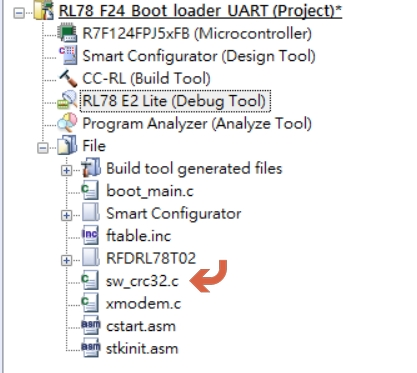
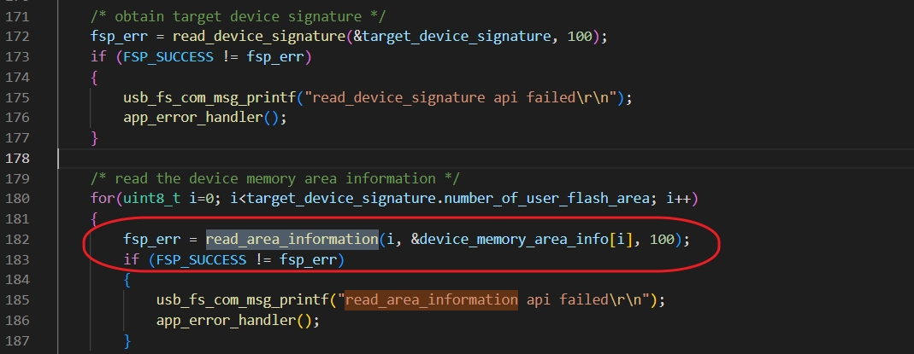
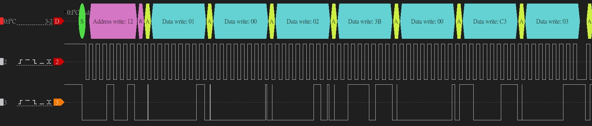
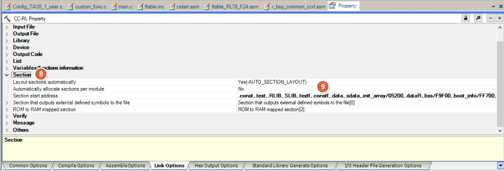

[return to index](https://released.github.io/)

<a id="article_top"></a>

# Agenda

* Introduce boot code and app code modification for RL78 
  * In this section , use RL78 F24 as example  
  <br/>


* reference document 
  * How to set up boot code and app project
  [How to Divide Boot and Flash Areas](https://www.renesas.com/en/document/man/rl78-family-c-compiler-package-cc-rl-how-divide-boot-and-flash-areas?srsltid=AfmBOoopybLnK6nMIfwPclpX1SYJL0OfZ1ZD5o9odBLUk4F70ckFtVWd)
  document no. : R20UT3475EJ0300
  <br/>

  <a id="target_MCU_flash_type"></a>
  * How to know the MCU need use which flash library type (code flash)
  [RL78 FAMILY FLASH MEMORY REPROGRAMMING SOFTWARE INTRODUCTION](https://www.renesas.com/en/document/oth/rl78-family-flash-memory-reprogramming-software-introduction?r=488891)

    * RL78 F23/F24 : Renesas Flash Driver RL78 Type 02 (document no. : R20UT5009EJ0110)
    [Renesas Flash Driver RL78 Type 02](https://www.renesas.com/en/document/mat/renesas-flash-driver-rl78-type-02-users-manual-rl78f23-and-rl78f24)
    * RL78 G22/G23/G24 : Renesas Flash Driver RL78 Type 01
    * RL78 G15/G16 : Renesas Flash Sample Program Type 01
    * RL78 x1x : Flash Self Programming Library Type01
  <br/>


__code base : polling__
* reference code base : boot code (RL78 F24)
[RL78_F24_Boot_loader_UART](https://github.com/released/RL78_F24_Boot_loader_UART)
[RL78_F24_Boot_loader_UART_e2](https://github.com/released/RL78_F24_Boot_loader_UART_e2)
<br/>

* reference code base : app code (RL78 F24)
[RL78_F24_Boot_loader_app](https://github.com/released/RL78_F24_Boot_loader_app)
[RL78_F24_Boot_loader_app_e2](https://github.com/released/RL78_F24_Boot_loader_app_e2)
<br/>

  * interface : xmodem by UART (polling)
  * interface : IICA0 (polling)
  * LDROM address : 0x0000 , size : 20K
  * APROM address : 0x5000 , size : 236K (CRC addr:3FFFC)
  * check define as below 

```c
#define ENABLE_UART_BL                                  (1)
#define ENALBE_IICA0_BL                                 (0)
```

__code base : interrupt__
* reference code base : boot code (RL78 F24)
[RL78_F24_Boot_loader_UART_CRC](https://github.com/released/RL78_F24_Boot_loader_UART_CRC)
<br/>

* reference code base : app code (RL78 F24)
[RL78_F24_Boot_loader_app_CRC](https://github.com/released/RL78_F24_Boot_loader_app_CRC)
<br/>

  * interface : xmodem by UART (polling) + TIMER interrupt
  * interface : IICA0 (interrupt) + TIMER interrupt
  * LDROM address : 0x0000 , size : 20K
  * APROM address : 0x5000 , size : 235K (CRC addr:3FBFC)
  * check define as below 

```c
#define ENABLE_UART_PRINTF                      (1)
#define ENABLE_UART_BL                          (1)

#define ENALBE_TIMER_TAU0_1_IRQ                 (1)

#define ENALBE_IICA0_BL                         (0)
#if ENALBE_IICA0_BL
#define ENALBE_IICA0_BL_USE_IRQ                 (1)
#endif
```


<span style="color:#FF0000">
<b><u>Key point</b></u><br><br>
</span> 

* project setting for boot code and app code 
* target MCU platform flash library usage and setting
* target interface initial and receive data 

---

# Flash architecture

MCU flash will split to Boot area (boot code) and Flash area (app code)


<u>How to Divide Boot and Flash Areas</u>

---

# Scenario : Boot area (boot code)

* use UART0 : P15/TX , P16/RX , to check terminal log meesgae
* __condition_check__ : 
  * detect ==flag== store in ram specific area (ex : 0xFF700) , to determine if re-boot from Flash area (app code) 
  * if no app code in app section


  * base on the ==flag== or ==BUTTON presssed (active LOW)== , to determine 
    * need to stay in boot code , to receive data flow from interface (ex : I2C , UART , ...) 
    * ready to jump into Flash area (app code)


* __verify_application_chksum__ : 
  * compare CRC checksum when power on 
  * at Flash area (app code) last 4 bytes , will store ==CRC data==
  * calculate the Flash area (app code) CRC byte (==caculate_crc32_checksum==) and compare to the CRC data store in last 4 bytes of Flash area (app code)
  * if comapare error , stay in Boot area (boot code) 


* any other custom user defined condition

* __programming Flash area (app code) flow__
  * refer the code flash sample function : Sample_CodeFlashControl and modify as : 
    * ==Sample_CodeFlashControl_Erase==
    * ==Sample_CodeFlashControl_SingleWrite==
    * __KEY POINT : SAMPLE_START_SECTION_SMP_CF__
  * after Flash area (app code) update finish , 
    * UART (xmodem , UART1 : P74/TX , P75/RX) : reboot MCU 
    * I2C (IICA0 , P62/SCL , P63/SDA): reboot MCU

xmodem


I2C


  * if CRC compare OK and no detect update inquiry , jump to Flash area (app code)


* at project:RL78_F24_Boot_loader_UART_CRC , add timer to control reset flow
  * when entry boot code in upgrade process , count down to 30 sec and execute reboot MCU if no receive data from interface (XMODEM , IICA0)


---

<a id="ram_flag"></a>

# Scenario : Flash area (app code)

* set ==ram flag== store in ram specific area (ex : 0xFF700) 
  * change flag data and execute reset , when
    * receive interface boot command (ex : I2C , UART , ...) 


  * any other custom user defined condition (ex : ADC , GPIO etc)
  * use terminal (UART0 : P15/TX , P16/RX) , by press ==digit 3== ,to set ram flag and reset


* by press ==digit 1== to write data flash 
* by press ==digit 2== to read data flash


* at Flash area (app code) last 4 bytes , will add ==CRC data== after ==project compile finish==


---

# Project : boot code/app code modifictaion - ftable.inc

<a id="FALSH_TABLE"></a>
<a id="ftable_inc"></a>
* ==create and register== below file in __Boot area (boot code)__ and __Flash area (app code)__ project

* ftable.inc 

```c
FLASH_TABLE       .EQU  0x5000 
INTERRUPT_OFFSET  .EQU  0x100 
```
<br/>

<a id="map_const"></a>
* the vaule will be ==boot code size (app code start address)==
* Due to mirror memory limitations, constant data cannot exist before mirror address - 0xF0000 (ex : 0xF5000 - 0xF0000 = 0x5000)
* below is each RL78 platform minimum boot code code size definition , FLASH_TABLE ==MUST set bigger or equal to== definition

| RL78 | const size |
|:--:|:--:|
| F24  | 0x5000 |
| F23  | 0x3000 |
| F13  | 0x2000 | 
| G15  | 0x800 |
| G16  | 0x800 |

* below is default project map file after compile

**RL78 F24**

**RL78 F23**

**RL78 F13**

**RL78 G15**

**RL78 G16**


<u>How to Divide Boot and Flash Areas</u>

---

# Project : boot code modifictaion - cstart.asm

refer to How to Divide Boot and Flash Areas :
__3.1.1  Modifying the startup routine (cstart.asm)__

* use smart config generate code
* ==copy== cstart.asm to boot code project root folder
* ==register== to Boot area (boot code) project , then start to ==modify==

(1) 
include [ftable.inc](#ftable_inc)


(2)
comment out conditional check


(3)
modify the section name


(4)
comment out conditional check and assembly instructions


(5)
modify main function name (__boot_main__) <a id="boot_main"></a>
add branch instructions : [FALSH_TABLE](#FALSH_TABLE)


(6)
comment out .const section


(7)
modify bsp_init_system function name


(8)
modify hardware init function name (__boot_hdwinit__) <a id="boot_hdwinit"></a>


(9)
increase bss size to 0x500


(10)
add ram flag section

```c
  .SECTION .boot_info, BSS
  .L_section_boot_info:
```


(11)
add ==code flash library section==


```c
  .SECTION RFD_DATA_nR, DATA
  .SECTION RFD_CMN_fR, TEXTF
  .SECTION RFD_CF_fR, TEXTF
  .SECTION SMP_CMN_fR, TEXTF
  .SECTION SMP_CF_fR, TEXTF
```


```c

	; copy RFD external variables having initial value (near)
	MOV	ES,#HIGHW(STARTOF(RFD_DATA_n))
	MOVW	BC,#LOWW(SIZEOF(RFD_DATA_n))
	BR	$.L2_RFD_DATA
.L1_RFD_DATA:
	DECW	BC
	MOV	A,ES:LOWW(STARTOF(RFD_DATA_n))[BC]
	MOV	LOWW(STARTOF(RFD_DATA_nR))[BC],A
.L2_RFD_DATA:
	CLRW	AX
	CMPW	AX,BC
	BNZ	$.L1_RFD_DATA


	; copy code to RAM (RFD_CMN)
	MOV	C,#HIGHW(STARTOF(RFD_CMN_f))
	MOVW	HL,#LOWW(STARTOF(RFD_CMN_f))
	MOVW	DE,#LOWW(STARTOF(RFD_CMN_fR))
	BR	$.L12_TEXT
.L11_TEXT:
	MOV	A,C
	MOV	ES,A
	MOV	A,ES:[HL]
	MOV	[DE],A
	INCW	DE
	INCW	HL
	CLRW	AX
	CMPW	AX,HL
	SKNZ
	INC	C
.L12_TEXT:
	MOVW	AX,HL
	CMPW	AX,#LOWW(STARTOF(RFD_CMN_f) + SIZEOF(RFD_CMN_f))
	BNZ	$.L11_TEXT

	; copy code to RAM (RFD_CF)
	MOV	C,#HIGHW(STARTOF(RFD_CF_f))
	MOVW	HL,#LOWW(STARTOF(RFD_CF_f))
	MOVW	DE,#LOWW(STARTOF(RFD_CF_fR))
	BR	$.L22_TEXT
.L21_TEXT:
	MOV	A,C
	MOV	ES,A
	MOV	A,ES:[HL]
	MOV	[DE],A
	INCW	DE
	INCW	HL
	CLRW	AX
	CMPW	AX,HL
	SKNZ
	INC	C
.L22_TEXT:
	MOVW	AX,HL
	CMPW	AX,#LOWW(STARTOF(RFD_CF_f) + SIZEOF(RFD_CF_f))
	BNZ	$.L21_TEXT

	; copy code to RAM (SMP_CMN)
	MOV	C,#HIGHW(STARTOF(SMP_CMN_f))
	MOVW	HL,#LOWW(STARTOF(SMP_CMN_f))
	MOVW	DE,#LOWW(STARTOF(SMP_CMN_fR))
	BR	$.L32_TEXT
.L31_TEXT:
	MOV	A,C
	MOV	ES,A
	MOV	A,ES:[HL]
	MOV	[DE],A
	INCW	DE
	INCW	HL
	CLRW	AX
	CMPW	AX,HL
	SKNZ
	INC	C
.L32_TEXT:
	MOVW	AX,HL
	CMPW	AX,#LOWW(STARTOF(SMP_CMN_f) + SIZEOF(SMP_CMN_f))
	BNZ	$.L31_TEXT

	; copy code to RAM (SMP_CF)
	MOV	C,#HIGHW(STARTOF(SMP_CF_f))
	MOVW	HL,#LOWW(STARTOF(SMP_CF_f))
	MOVW	DE,#LOWW(STARTOF(SMP_CF_fR))
	BR	$.L42_TEXT
.L41_TEXT:
	MOV	A,C
	MOV	ES,A
	MOV	A,ES:[HL]
	MOV	[DE],A
	INCW	DE
	INCW	HL
	CLRW	AX
	CMPW	AX,HL
	SKNZ
	INC	C
.L42_TEXT:
	MOVW	AX,HL
	CMPW	AX,#LOWW(STARTOF(SMP_CF_f) + SIZEOF(SMP_CF_f))
	BNZ	$.L41_TEXT
```


---

boot code : Compare below file to see the difference
after modification : 
RL78_F24_Boot_loader_UART\cstart.asm
https://github.com/released/RL78_F24_Boot_loader_UART/blob/main/cstart.asm

code flash : 
RL78_F24_Boot_loader_UART\RFDRL78T02\sample\RL78_F24\CF\CCRL\source\cstart.asm

smart configurator original file : 
RL78_F24_Boot_loader_UART\src\smc_gen\r_bsp\mcu\all\cstart.asm


<u>How to Divide Boot and Flash Areas</u>

---

# Project : boot code modifictaion - stkinit.asm

refer to How to Divide Boot and Flash Areas :
__3.1.2  Modifying hdwinit.asm and stkinit.asm__

* use smart config generate code 
* ==copy== stkinit.asm to boot code project root folder
* ==register== to Boot area (boot code) project , then start to ==modify==

- modify the section name


<u>How to Divide Boot and Flash Areas</u>

---

# Project : boot code modifictaion - project tree

* after modification , ==Boot area (boot code) project== will increse 3 files as below 


* make sure manual register ==cstart.asm , stkinit.asm== if file ==missing== after ==generate code==


<u>How to Divide Boot and Flash Areas</u>

---

# Project : boot code modifictaion - add CODE FLASH library

* base on [RL78 MCU](#target_MCU_flash_type)  , register correspond ==CODE FLASH library== into Boot area (boot code) project and exclude uncessary file (data flash , extra area)


---

* refer to RL78_F24_Boot_loader_UART\RFDRL78T02\sample\common\source\codeflash\sample_control_code_flash.c
* __KEY POINT : SAMPLE_START_SECTION_SMP_CF__

* __Sample_CodeFlashControl_Erase__

```c
R_RFD_FAR_FUNC e_sample_ret_t Sample_CodeFlashControl_Erase(uint32_t i_u32_start_addr)
{
    /* Local variable definition */
    e_rfd_ret_t    l_e_rfd_ret_status;
    e_sample_ret_t l_e_sam_ret_status;
    e_sample_ret_t l_e_sam_ret_value;
    bool           l_e_sam_error_flag;
    // uint16_t       l_u16_count;
    uint16_t       l_u16_block_number;
    // uint32_t       l_u32_check_write_data_addr;
    
    /* Set local variables */
    l_e_sam_ret_value           = SAMPLE_ENUM_RET_STS_OK;
    l_e_sam_error_flag          = false;
    
    /* This expression (actual block number) never exceeds the range of casting uint16_t */
    l_u16_block_number          = (uint16_t)(i_u32_start_addr >> SAMPLE_VALUE_U08_SHIFT_ADDR_TO_BLOCK_CF);
    // l_u32_check_write_data_addr = i_u32_start_addr;
    
    /******************************************************************************************************************
     * Set the code flash programming mode
     *****************************************************************************************************************/
    l_e_rfd_ret_status = R_RFD_SetFlashMemoryMode(R_RFD_ENUM_FLASH_MODE_CODE_PROGRAMMING);
    
    if (R_RFD_ENUM_RET_STS_OK != l_e_rfd_ret_status)
    {
        l_e_sam_error_flag = true;
        l_e_sam_ret_value  = SAMPLE_ENUM_RET_ERR_MODE_MISMATCHED;
    }
    else
    {
        /* No operation */
    }
    
    /******************************************************************************************************************
     * BLANKCHECK -> ERASE
     *****************************************************************************************************************/
    if (false == l_e_sam_error_flag)
    {
        /* BLANKCHECK (1 block) */
        R_RFD_BlankCheckCodeFlashReq(l_u16_block_number);
        l_e_sam_ret_status = Sample_CheckCFDFSeqEnd();
        
        if (SAMPLE_ENUM_RET_ERR_ACT_BLANKCHECK == l_e_sam_ret_status)
        {
            /* ERASE (1 block) */
            R_RFD_EraseCodeFlashReq(l_u16_block_number);
            l_e_sam_ret_status = Sample_CheckCFDFSeqEnd();
            
            if (SAMPLE_ENUM_RET_STS_OK != l_e_sam_ret_status)
            {
                l_e_sam_error_flag = true;
                l_e_sam_ret_value  = SAMPLE_ENUM_RET_ERR_CMD_ERASE;
            }
            else
            {
                /* No operation */
            }
        }
        else if (SAMPLE_ENUM_RET_STS_OK != l_e_sam_ret_status)
        {
            l_e_sam_error_flag = true;
            l_e_sam_ret_value  = SAMPLE_ENUM_RET_ERR_CMD_BLANKCHECK;
        }
        else
        {
            /* No operation */
        }
    }
    else /* true == l_e_sam_error_flag */
    {
        /* No operation */
    }
        
    /******************************************************************************************************************
     * Set non-programmable mode
     *****************************************************************************************************************/
    l_e_rfd_ret_status = R_RFD_SetFlashMemoryMode(R_RFD_ENUM_FLASH_MODE_CODE_TO_NONPROGRAMMABLE);
    
    if (R_RFD_ENUM_RET_STS_OK != l_e_rfd_ret_status)
    {
        l_e_sam_error_flag = true;
        l_e_sam_ret_value  = SAMPLE_ENUM_RET_ERR_MODE_MISMATCHED;
    }
    else
    {
        /* No operation */
    }
        
    return (l_e_sam_ret_value);
}
```

* __Sample_CodeFlashControl_SingleWrite__

```c
R_RFD_FAR_FUNC e_sample_ret_t Sample_CodeFlashControl_SingleWrite(uint32_t i_u32_start_addr,
                                                      uint8_t __near * inp_u08_write_data)
{
    /* Local variable definition */
    e_rfd_ret_t    l_e_rfd_ret_status;
    e_sample_ret_t l_e_sam_ret_status;
    e_sample_ret_t l_e_sam_ret_value;
    bool           l_e_sam_error_flag;
    uint16_t       l_u16_count = 0;
    // uint16_t       l_u16_block_number;
    // uint32_t       l_u32_check_write_data_addr;
    
    /* Set local variables */
    l_e_sam_ret_value           = SAMPLE_ENUM_RET_STS_OK;
    l_e_sam_error_flag          = false;
    
    /* This expression (actual block number) never exceeds the range of casting uint16_t */
    // l_u16_block_number          = (uint16_t)(i_u32_start_addr >> SAMPLE_VALUE_U08_SHIFT_ADDR_TO_BLOCK_CF);
    // l_u32_check_write_data_addr = i_u32_start_addr;
    
    /******************************************************************************************************************
     * Set the code flash programming mode
     *****************************************************************************************************************/
    l_e_rfd_ret_status = R_RFD_SetFlashMemoryMode(R_RFD_ENUM_FLASH_MODE_CODE_PROGRAMMING);
    
    if (R_RFD_ENUM_RET_STS_OK != l_e_rfd_ret_status)
    {
        l_e_sam_error_flag = true;
        l_e_sam_ret_value  = SAMPLE_ENUM_RET_ERR_MODE_MISMATCHED;
    }
    else
    {
        /* No operation */
    }
   
    /******************************************************************************************************************
     * WRITE
     *****************************************************************************************************************/
    if (false == l_e_sam_error_flag)
    {
        // for (l_u16_count = 0u; l_u16_count < i_u16_write_data_length; l_u16_count += 4u)
        {
            // R_RFD_WriteCodeFlashReq(i_u32_start_addr + l_u16_count, &inp_u08_write_data[l_u16_count]);
            R_RFD_WriteCodeFlashReq(i_u32_start_addr , &inp_u08_write_data[l_u16_count]);
            l_e_sam_ret_status = Sample_CheckCFDFSeqEnd();
            
            if (SAMPLE_ENUM_RET_STS_OK != l_e_sam_ret_status)
            {
                l_e_sam_error_flag = true;
                l_e_sam_ret_value  = SAMPLE_ENUM_RET_ERR_CMD_WRITE;
                // break;
            }
            else
            {
                /* No operation */
            }
        }
    }
    else /* true == l_e_sam_error_flag */
    {
        /* No operation */
    }
        
    /******************************************************************************************************************
     * Set non-programmable mode
     *****************************************************************************************************************/
    l_e_rfd_ret_status = R_RFD_SetFlashMemoryMode(R_RFD_ENUM_FLASH_MODE_CODE_TO_NONPROGRAMMABLE);
    
    if (R_RFD_ENUM_RET_STS_OK != l_e_rfd_ret_status)
    {
        l_e_sam_error_flag = true;
        l_e_sam_ret_value  = SAMPLE_ENUM_RET_ERR_MODE_MISMATCHED;
    }
    else
    {
        /* No operation */
    }
    
    return (l_e_sam_ret_value);
}


```

<u>Renesas Flash Driver RL78 Type 02 User’s  Manual</u>

---

# Project : boot code modifictaion - add CRC compare (1)

* register CRC compare into Boot area (boot code) project 
* purpose: 
  * condition check (check and compare app code CRC , prevent jump into corrupted app code)




---

# Project : boot code modifictaion - add CRC compare (2)

<br/>
<span style="color:#FF0000">
CRC in app code last 4 bytes will be added after compile at <b><u>app code project</u></b> by use SRecord tool<br/><br/>
</span>


---

# Project : boot code modifictaion - use smart config tool to generate driver

* use smart config to generate target interface drvier , to use in boot code project
  * make sure manual register ==cstart.asm , stkinit.asm== if file ==missing== after ==generate code==


* move those driver function into boot_main.c (to reduce boot code size and prevent duplicate function call in app code)
* exclude the driver code (c code , asm code)


---

* smart configurator system setting as below


---

# Project : boot code modifictaion - boot_main.c

* for boot_hdwinit() , will be initialized by [cstart.asm](#boot_hdwinit)
  * ==copy== below function from driver and ==rename== with prefix: ==boot_== in boot_main.c for boot_hdwinit
    * bsp_init_system() 
      * copy mcu_clock_setup()
    * R_Config_PORT_Create
    * if use UART for debug or download
      * R_SAU0_Create()
      * R_Config_UART0_Start()
      * R_SAU1_Create()
      * R_Config_UART1_Start()
    * R_Config_IICA0_Create()
    * R_Config_TAU0_0_Start , for delay function (1ms)
* for boot_main() , will start with condition check and judge if need to start programming

---

# Project : boot code modifictaion - I2C command flow

* No READ operation
* No Authentication operation


---

# Project : boot code modifictaion - I2C command flow (check_generic_boot_standard_interface)

(0) send initial byte (master)


(1) boot mode check command byte (master)


(1-1) check read status (master)


(2) device inquiry command packet (master)


(2-1) report status about device inquiry command packet (slave)


---

# Project : boot code modifictaion - I2C command flow (read_device_signature)

(3) obtain target device signature (master)


(3-1) report status about obtain target device signature (slave)


---

# Project : boot code modifictaion - I2C command flow (read_area_information)

(4) obtain target device signature  (master)




(4-1) report status about obtain target device signature  (slave)


---

# Project : boot code modifictaion - I2C command flow (start_device_image_transfer)

(5) erase user code flash area (master)


(5-1) report status about erase user code flash area (slave)


(6) initiate write user code flash area (master)


(6-1) report status about initiate write user code flash area (master)


---

# Project : boot code modifictaion - I2C command flow terminal operation (master & slave)

(1) log message at master : set target image 


(2) log message at master : check slave status


(3) log message at master : program binary to slave code flash


(4) log message at slave : erase (RL78 F24)


(5) log message at slave : programming finish (RL78 F24)


(6) code flow at slave : WriteCodeFlash (RL78 F24)


erase per page (1K bytes) , program per 4 bytes


---

# Project : boot code modifictaion - xmodem update flow

below is at xmodem update when g_app_required_update == 1


when trig update flow , will wait for xmodem from PC host


use teraterm , to send file under xmodem


when under transmit binary file


trasmit time , update RL78 F24 app code : 236K
* with boot code enable log message (xmodem.c , check debug3) , spent 41 sec

* without boot code enable log message (xmodem.c , check debug3) , spent 40 sec


when update app code finish


---

# Project : boot code property modifictaion - E2 lite setting


<u>CC-RL Compiler User's Manual</u>
<u>CS+ User’s Manual: CC-RL Build Tool Operation</u>


---

# Project : boot code property modifictaion - CC-RL Build Tool setting

**Common Options**

refer to How to Divide Boot and Flash Areas :
__3.2.5  Specifying hex file output only to the boot area address range__


* __[Frequently Used Options (for Hex Output)] > [Division output file]__
  * base on MCU (ex : RL78F24) , to set boot code ==start address and end address== as file name
* file size will be different if use other platform (ex : RL78 F13 , RL78 G16 , etc)
  * [map const define ?](#map_const)

```c
%BuildModeName%\boot0000_4FFF.hex=0000-4FFF
```

| RL78 | const size |
|:--:|:--:|
| F24  | 0x5000 |
| F23  | 0x3000 |
| F13  | 0x2000 | 
| G15  | 0x800 |
| G16  | 0x800 |

---


<a id="fsy_file"></a>
* __[Other] > [Commands executed after build processing]__
  * add : copy_fsy.bat
  * copy ==boot code project fsy== file to app code project root folder

```c
copy /y/v .\DefaultBuild\RL78_F24_Boot_loader_UART.fsy ..\RL78_F24_Boot_loader_app\
```


<u>How to Divide Boot and Flash Areas</u>
<u>CC-RL Compiler User's Manual</u>
<u>CS+ User’s Manual: CC-RL Build Tool Operation</u>

---

# Project : boot code property modifictaion - CC-RL Build Tool setting

**Compile Options**


<u>How to Divide Boot and Flash Areas</u>
<u>CC-RL Compiler User's Manual</u>
<u>CS+ User’s Manual: CC-RL Build Tool Operation</u>

---

# Project : boot code property modifictaion - CC-RL Build Tool setting

**Link Options**


* __[Device] > [Option byte values for OCD]__
  * set to ```A5```
  * default will be 0xFF

<br>


* __[Output Code] > [Execute start address]__
  * will be called by cstart.asm
<br>

---
<a id="vect_address"></a>
* __[Output Code] > [Address setting for specified area for vector table]__
  * use vect_address.xlsx under boot code project , to copy shift address


  * entry editor and paste the shift address
  

  * the final result : 

<br>


---


* __[List] > [Ooutput link map file]__
  * select -SHow=ALL , will display the compile result (function , address) in map file for debug
  * map file under /DefaultBuild
  

* refer to document : 
  * How to Divide Boot and Flash Areas (R20UT3475EJ0300) 
    * __3.2.2  Specifying the section allocation__
  * Renesas Flash Driver RL78 Type 02 User’s  Manual (R20UT5009EJ0110) 
    * __6.1.3.3  Section Item Settings__
<br>

---


* __[Section] > [Section start address]__

  * set __Layout sections automatically__ to ==NO== 
  * entry editor and modify as below ( for code flash library ) 
  * flash area
  ```
  RFD_DATA_n 
  RFD_CMN_f 
  RFD_CF_f 
  SMP_CMN_f 
  SMP_CF_f 

  ```

  * ram area
  ```
  RFD_DATA_nR 
  RFD_CMN_fR 
  RFD_CF_fR
  SMP_CMN_fR 
  SMP_CF_fR  

  ```

  
<br>

* __[Section] > [Section that outputs external symbols to the file]__
  * entry editor and modify as below : 

  ```
  .constf
  .text
  .textf
  .bss
  .sbss
  .data
  .sdata
  .RLIB
  .SLIB  
  ```


<br>

* reserve SRAM flag 0xFF700 area [(ram flag)](#ram_flag) , to prevent initial when power on

* __[Section] > [ROM to RAM mapped section]__
  * entry editor and modify as below :

  ```
  .data=.dataR
  .sdata=.sdataR
  RFD_DATA_n=RFD_DATA_nR 
  RFD_CMN_f=RFD_CMN_fR 
  RFD_CF_f=RFD_CF_fR 
  SMP_CMN_f=SMP_CMN_fR 
  SMP_CF_f=SMP_CF_fR

  ``` 


  * set __Layout sections automatically__ to ==YES== 
  * the final result : 


<br>

---

* how do we know section address meaning


  * ==flash assignment after debug area==
    * 0x000F0 (RL78 F24 , F23)

---


  * ==ram assignment==
    * 0xF9F00 (RL78 F24)
    * 0xFCF00 (RL78 F23)


---


  * ==short direction address (.saddr) assignment==
    * 0xFFE20 (RL78 F24 , F23)


---

* in case of need to modify from RL78 F24 to RL78 F23 (code flash , data flash , extra area)
  * code flash
  
  * data flash
  
  * extra area
  
  * RAM
  
<br>

---


* __[Others] > [Display total size sections]__
  * select -Total_size , will display the section size in output window
  * display build code size in Output window


<u>How to Divide Boot and Flash Areas</u>
<u>CC-RL Compiler User's Manual</u>
<u>CS+ User’s Manual: CC-RL Build Tool Operation</u>
<u>Renesas Flash Driver RL78 Type 02 User’s  Manual</u>

---

# Project : boot code property modifictaion - CC-RL Build Tool setting

**Hex Output Options**

refer to How to Divide Boot and Flash Areas :
__3.2.5  Specifying hex file output only to the boot area address range__


* __[Output File] > [Division output file]__  
  * base on MCU (ex : RL78F24) , to set boot code ==start address and end address== as file name
* file size will be different if use other platform (ex : RL78 F13 , RL78 G16 , etc)
  * [map const define ?](#map_const)

```c
%BuildModeName%\boot0000_4FFF.hex=0000-4FFF
```

| RL78 | const size |
|:--:|:--:|
| F24  | 0x5000 |
| F23  | 0x3000 |
| F13  | 0x2000 | 
| G15  | 0x800 |
| G16  | 0x800 |

<br>

---


* __[Hex Format]__  
  * follow the setting of the picture 


<u>How to Divide Boot and Flash Areas</u>
<u>CC-RL Compiler User's Manual</u>
<u>CS+ User’s Manual: CC-RL Build Tool Operation</u>
<u>Renesas Flash Driver RL78 Type 02 User’s  Manual</u>

---

# Reference - RL78/F23, F24 User’s Manual: Hardware - Input Source List


---
<a id="vector_table"></a>
# Project : RL78/F23, F24 User’s Manual: Hardware - Vector Table


---

# Project : boot code/app code modifictaion - ftable.inc

<a id="FALSH_TABLE"></a>
<a id="ftable_inc"></a>
* ==create and register== below file in __Boot area (boot code)__ and __Flash area (app code)__ project

* ftable.inc 

```c
FLASH_TABLE       .EQU  0x5000 
INTERRUPT_OFFSET  .EQU  0x100 
```
<br/>

<a id="map_const"></a>
* the vaule will be ==boot code size (app code start address)==
* Due to mirror memory limitations, constant data cannot exist before mirror address - 0xF0000 (ex : 0xF5000 - 0xF0000 = 0x5000)
* below is each RL78 platform minimum boot code code size definition , FLASH_TABLE ==MUST set bigger or equal to== definition

| RL78 | const size |
|:--:|:--:|
| F24  | 0x5000 |
| F23  | 0x3000 |
| F13  | 0x2000 | 
| G15  | 0x800 |
| G16  | 0x800 |

* below is default project map file after compile

**RL78 F24**

**RL78 F23**

**RL78 F13**

**RL78 G15**

**RL78 G16**


<u>How to Divide Boot and Flash Areas</u>

---


# Project : app code modifictaion - cstart.asm

refer to How to Divide Boot and Flash Areas :
__4.1.1  Modifying the startup routine (cstart.asm)__

* use smart config generate code
* ==copy== cstart.asm to app code project root folder
* ==register== to Flash area (app code) project , then start to ==modify==

(1)
comment out conditional check


(2)
add ram flag section

```c
  .SECTION .boot_info, BSS
  .L_section_boot_info:
```


(3)
add ==data flash library section==

```c
  .SECTION RFD_DATA_nR, DATA
```


```c
	; copy RFD external variables having initial value (near)
	MOV	ES,#HIGHW(STARTOF(RFD_DATA_n))
	MOVW	BC,#LOWW(SIZEOF(RFD_DATA_n))
	BR	$.L2_RFD_DATA
.L1_RFD_DATA:
	DECW	BC
	MOV	A,ES:LOWW(STARTOF(RFD_DATA_n))[BC]
	MOV	LOWW(STARTOF(RFD_DATA_nR))[BC],A
.L2_RFD_DATA:
	CLRW	AX
	CMPW	AX,BC
	BNZ	$.L1_RFD_DATA

```


---

app code : Compare below file to see the difference
after modification : 
RL78_F24_Boot_loader_app\cstart.asm
https://github.com/released/RL78_F24_Boot_loader_app/blob/main/cstart.asm

data flash : 
RL78_F24_Boot_loader_app\RFDRL78T02\sample\RL78_F24\DF\CCRL\source\cstart.asm

smart configurator original file : 
RL78_F24_Boot_loader_app\src\smc_gen\r_bsp\mcu\all\cstart.asm


<u>How to Divide Boot and Flash Areas</u>

---

# Project : app code modifictaion - ftable.asm

refer to How to Divide Boot and Flash Areas :
__4.1.2  Creating a branch table program (ftable.asm)__

* create ftable and register interrupt (used in app code) in proper sequence
  * [vector table ?](#vector_table)


* ==register== ftable to Flash area (app code) project


* example 
  * in app code , use UART0 TX/RX , UART1 TX/RX , TAU0_1 , IICA0 interrupt
  * register these interrupt name with prefix !!_ 

```c
		.DB4    0xffffffff                      ; INTP13/INTCL	             	;0x0014
		 BR     !!_r_Config_UART0_interrupt_send	; INTST0/INTCSI00/INTIIC00  ;0x0016
		 BR     !!_r_Config_UART0_interrupt_receive	; INTSR0/INTCSI01/INTIIC01 	;0x0018
		.DB4    0xffffffff						; INTTRD0                       ;0x001A
    ...
		.DB4    0xffffffff					    ; INTLIN0STA/INTLIN0	        ;0x0026
		 BR     !!_r_Config_IICA0_interrupt	    ; INTIICA0 		                ;0x0028
		.DB4    0xffffffff                      ; INTP8/INTRTC                  ;0x002A
		.DB4    0xffffffff      				; INTTM00                     	;0x002C
		 BR     !!_r_Config_TAU0_1_interrupt    ; INTTM01                       ;0x002E
		.DB4    0xffffffff                	    ; INTTM02                       ;0x0030
    ...
		.DB4    0xffffffff                      ; INTP10/INTTM03H               ;0x003C
		 BR     !!_r_Config_UART1_interrupt_send	; INTST1/INTCSI10/INTIIC10      ;0x003E
		 BR     !!_r_Config_UART1_interrupt_receive	; INTSR1/INTCSI11/INTIIC11      ;0x0040
		.DB4    0xffffffff					    ; INTTM04                       ;0x0042

```

<u>How to Divide Boot and Flash Areas</u>

---

# Project : app code modifictaion - fsy file

refer to How to Divide Boot and Flash Areas :
__4.2.1  Registering the externally defined symbol file with the project__

* when boot code build finish , will copy fsy file into app code project 
  * [fsy file ?](#fsy_file)
* ==register== fsy file to Flash area (app code) project


<u>How to Divide Boot and Flash Areas</u>

---

# Project : app code modifictaion - project tree

* after modification , ==Flash area (app code) project== will increse 4 files as below 


---

# Project : app code modifictaion - add DATA FLASH library

* base on [RL78 MCU](#target_MCU_flash_type)  , register correspond ==DATA FLASH library== into Flash area (app code) project and exclude uncessary file (code flash , extra area)


---

# Project : app code modifictaion - use smart config tool to generate driver

* exclude the driver code (c code , asm code)


---

* smart configurator system setting as below


---


# Project : app code modifictaion -  remove static and vect define

refer to How to Divide Boot and Flash Areas :
__Do not specify the vector address (vect) with the #pragma interrupt directive in the flash area.__

* ==EVERY TIME== when use smart config tool to ==re-generate driver==
* need to ==remove static declaration== and ==comment on vect definition== in earch drvier ==Config_xxx_user.c==


<u>How to Divide Boot and Flash Areas</u>

---

# Project : app code modifictaion - main.c

* add [ram flag](#ram_flag) declaration

```c
#define RESET_TO_BOOT_SIGN 0xAA55AA55

#pragma address (reset_to_bootloader = 0x000FF700)
volatile uint32_t reset_to_bootloader;
#pragma address (_no_init_global = 0x000FF710)
unsigned char _no_init_global[RAM_FLAG_MAX];

```
below is map file result 


* add change flag data ==condition check== and execute reset

  * example : when receive change to boot mode command , modify the flag and reset MCU

```c
    if(g_i2c_receive_complete)
    {
        if(0 == memcmp(&iic_buf[0], switch_device_to_boot_mode_cmd, 6))
        {
            R_Config_IICA0_Slave_Send((uint8_t *)response_status_ok, 7);
            while(!g_i2c_transmit_complete);

            reset_to_bootloader = RESET_TO_BOOT_SIGN;
            _reset_by_illegal_memory_access();
        }

        g_i2c_receive_complete = false;
    }

```

```c
void uart_rcv_process(void)
{
    if (FLAG_PROJ_TRIG_3)
    {
        FLAG_PROJ_TRIG_3 = 0;

        reset_to_bootloader = RESET_TO_BOOT_SIGN;
        printf_tiny("(app)reset_to_bootloader:0x%X",reset_to_bootloader>>16);
        printf_tiny("%X\r\n",reset_to_bootloader&0xFFFF);

        _reset_by_illegal_memory_access();        
    }
}
```

---
# Project : app code property modifictaion - E2 lite setting


<u>CC-RL Compiler User's Manual</u>
<u>CS+ User’s Manual: CC-RL Build Tool Operation</u>

---

# Project : app code property modifictaion - CC-RL Build Tool setting

**Common Options**

refer to How to Divide Boot and Flash Areas :
__4.2.3  Specifying hex file output only to the flash area address range__


* __[Frequently Used Options (for Hex Output)] > [Division output file]__
  * base on MCU (ex : RL78F24 , 256K flash) , to ==app code start address and end address== as file name
* file size will be different if use other platform (ex : RL78 F13 , RL78 G16 , etc)
  * [map const define ?](#map_const)

```c
%BuildModeName%\flash5000_3FFFF.hex=5000-3FFFF
```


---


* __[Other] > [Commands executed after build processing]__
  * add : boot_flash.bat , for RL78 F24 (256K)
  * use srecord tool , do action as below
    * save app code hex to back hex file
      * 1backupHex.cmd
    * base on app code hex , generate CRC
      * 2generateChecksum.cmd
    * base on app code hex (w/ CRC) , generate CRC into hex
      * 3generateCRCHex.cmd
    * covert app code hex (w/ CRC) to app code bin
      * 4generateCRCBin.cmd
    * base on app code hex (w/ CRC) , to over lap original hex
      * 5generateCRCHexOverlap.cmd
    * combine boot code and app code
      * 6generateBootAppHex.cmd
    * covert boot/app code hex (w/ CRC) to boot/app code bin
      * 7generateBootAppBin.cmd

<br>

__1backupHex.cmd__
```c
# input file
.\DefaultBuild\flash5000_3FFFF.hex -Intel

-crop 0x005000 0x40000

# produce the output file
-Output
.\DefaultBuild\flash5000_3FFFF_backup.hex -Intel

```

<br>

__2generateChecksum.cmd__
```c
# input file
.\DefaultBuild\flash5000_3FFFF.hex -Intel

-crop 0x5000 0x3FFFC

-crc32-l-e 0x3FFFC		

-crop 0x3FFFC 0x40000
											
-Output 
- 
-HEX_Dump

```

<br>

__3generateCRCHex.cmd__
```c

# input file
.\DefaultBuild\flash5000_3FFFF.hex -Intel

-crop 0x5000 0x3FFFC

-crc32-l-e 0x3FFFC

-Output
.\DefaultBuild\flash5000_3FFFF_CRC.hex -Intel

```

<br>

__4generateCRCBin.cmd__
```c

# input file
.\DefaultBuild\flash5000_3FFFF_CRC.hex -Intel

-crop 0x005000 0x40000 -offset -0x005000

# produce the output file
-Output
.\DefaultBuild\flash5000_3FFFF.bin -binary

```

<br>

__5generateCRCHexOverlap.cmd__
```c

# input file
.\DefaultBuild\flash5000_3FFFF_CRC.hex -Intel

-crop 0x005000 0x40000

# produce the output file
-Output
.\DefaultBuild\flash5000_3FFFF.hex -intel

```

<br>

__6generateBootAppHex.cmd__
```c
..\RL78_F24_Boot_loader_UART\DefaultBuild\boot0000_4FFF.hex -Intel .\DefaultBuild\flash5000_3FFFF.hex -Intel -o .\boot_app.hex -Intel -Output_Block_Size=16

```

<br>

__7generateBootAppBin.cmd__
```c

# input file
.\boot_app.hex -Intel

-crop 0x00000 0x40000

# produce the output file
-Output
.\boot_app.bin -binary

```

---

use RFP to download whole program : boot_app.bin(boot code + app code)


__boot+app binary folder__ : 
RL78_F24_Boot_loader_app\boot_app.bin

__boot code binary folder__ : 
RL78_F24_Boot_loader_UART\DefaultBuild\boot0000_4FFF.hex

__app code binary folder__ : 
RL78_F24_Boot_loader_app\DefaultBuild\flash5000_3FFFF.bin
RL78_F24_Boot_loader_app\DefaultBuild\flash5000_3FFFF.hex

---

# Project : app code property modifictaion - CC-RL Build Tool setting

**Compile Options**


<u>How to Divide Boot and Flash Areas</u>
<u>CC-RL Compiler User's Manual</u>
<u>CS+ User’s Manual: CC-RL Build Tool Operation</u>


---

# Project : app code property modifictaion - CC-RL Build Tool setting

**Link Options**


* __[Device] > [Option byte values for OCD]__
  * set to ```A5```
  * default will be 0xFF

<br>


* __[Output Code] > [Execute start address]__
  * will be called by cstart.asm
<br>


---


* __[List] > [Ooutput link map file]__
  * select -SHow=ALL , will display the compile result (function , address) in map file for debug
  * map file under /DefaultBuild

* refer to document : 
  * How to Divide Boot and Flash Areas (R20UT3475EJ0300) 
    * __3.2.2  Specifying the section allocation__
  * Renesas Flash Driver RL78 Type 02 User’s  Manual (R20UT5009EJ0110) 
    * __6.1.3.3  Section Item Settings__
<br>

---


* __[Section] > [Section start address]__

refer to How to Divide Boot and Flash Areas :
__4.2.2  Specifying the section allocation__

  * set __Layout sections automatically__ to ==NO== 
  * app code will start from 0x5000 (RL78 F24) , and reserved branch table area (0x5200)
  * entry editor and modify as below ( for data flash library )
  * flash area
  ```
  RFD_DATA_n 
  RFD_CMN_f 
  RFD_DF_f 
  SMP_CMN_f 
  SMP_DF_f 

  ```

  * ram area
  ```
  RFD_DATA_nR 

  ```

  * reserve SRAM flag 0xFF700 area [(ram flag)](#ram_flag) , to prevent initial when power on

  * __[Section] > [ROM to RAM mapped section]__
    * entry editor and modify as below :

  ```
  .data=.dataR
  .sdata=.sdataR
  RFD_DATA_n=RFD_DATA_nR
  ``` 


  * set __Layout sections automatically__ to ==YES==
  * the final result : 


<br>

---


* __[Others] > [Display total size sections]__
  * select -Total_size , will display the section size in output window
  * display build code size in Output window


<u>How to Divide Boot and Flash Areas</u>
<u>CC-RL Compiler User's Manual</u>
<u>CS+ User’s Manual: CC-RL Build Tool Operation</u>
<u>Renesas Flash Driver RL78 Type 02 User’s  Manual</u>


---

# Project : app code property modifictaion - CC-RL Build Tool setting

**Hex Output Options**

refer to How to Divide Boot and Flash Areas :
__4.2.3  Specifying hex file output only to the flash area address range__


* __[Output File] > [Division output file]__  
  * base on MCU (ex : RL78F24) , to set ==app code start address and end address== as file name
* file size will be different if use other platform (ex : RL78 F13 , RL78 G16 , etc)
  * [map const define ?](#map_const)

```c
%BuildModeName%\flash5000_3FFFF.hex=5000-3FFFF
```

---


* __[Hex Format]__  
  * follow the setting of the picture 


<u>How to Divide Boot and Flash Areas</u>
<u>CC-RL Compiler User's Manual</u>
<u>CS+ User’s Manual: CC-RL Build Tool Operation</u>
<u>Renesas Flash Driver RL78 Type 02 User’s  Manual</u>


---

# How to add interrupt at boot code 

__I2C example__
refer to define : ENALBE_IICA0_BL_USE_IRQ in project:RL78_F24_Boot_loader_UART_CRC

add interrupt vect declare in boot code 
  * use smart config generate driver code and move to boot_main.c
  * use [#pragma interrupt] to declare custom interrupt 
  * vect refer to [vector table ](#vector_table)
  * use ram flag (ex:_no_init_global[RAM_FLAG_INDICATE_BOOT_APP]) to define excute which irq when in boot code / app code
    * declare ram_flag = 0xAA when in boot code
    * declare ram_flag = 0x55 when in app code
  * add boot code interrupt process (ex:I2C_Downloader_routine_IRQ)
  * interrupt process in app code wll be defined as [vector number](#vect_address)


```C
#pragma interrupt boot_r_Config_IICA0_interrupt(vect=INTIICA0)
void __near boot_r_Config_IICA0_interrupt(void)
{
	if(_no_init_global[RAM_FLAG_INDICATE_BOOT_APP] == 0xAA)   // execute boot code ISR
	{
        if (0U == (IICS0 & _80_IICA_STATUS_MASTER))
        {            
            I2C_Downloader_routine_IRQ();   // r_Config_IICA0_slave_handler();
        }
	}
	if(_no_init_global[RAM_FLAG_INDICATE_BOOT_APP] == 0x55)   //user app ISR address
	{	    	
        if (0U == (IICS0 & _80_IICA_STATUS_MASTER))
        {
            ((void(*)(void))0x5050)();	
        }
	}
}
```


__TIMER example__
refer to define : ENALBE_TIMER_TAU0_1_IRQ in project:RL78_F24_Boot_loader_UART_CRC

add interrupt vect declare in boot code 
  * use smart config generate driver code and move to boot_main.c
  * use [#pragma interrupt] to declare custom interrupt 
  * vect refer to [vector table ](#vector_table)
  * use ram flag (ex:_no_init_global[RAM_FLAG_INDICATE_BOOT_APP]) to define excute which irq when in boot code / app code
    * declare ram_flag = 0xAA when in boot code
    * declare ram_flag = 0x55 when in app code
  * add boot code interrupt process (ex:boot_Timer_1ms_IRQ)
  * interrupt process in app code wll be defined as [vector number](#vect_address)


```C
#pragma interrupt boot_r_Config_TAU0_1_interrupt(vect=INTTM01)
void __near boot_r_Config_TAU0_1_interrupt(void)
{
	if(_no_init_global[RAM_FLAG_INDICATE_BOOT_APP] == 0xAA)   // execute boot code ISR
	{
        boot_Timer_1ms_IRQ();
	}
	if(_no_init_global[RAM_FLAG_INDICATE_BOOT_APP] == 0x55)   //user app ISR address
	{	    	
        ((void(*)(void))0x505C)();
	}
}
```


---

