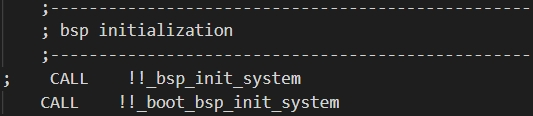
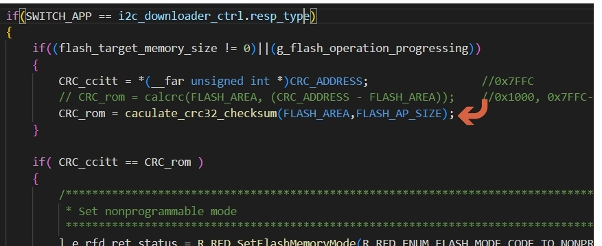
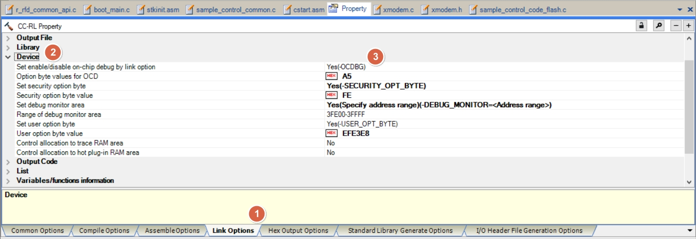

<a id="article_top"></a>

# Agenda

* Introduce boot code and app code modification for RL78 
  * In this section , use RL78 F24 as example  
  <br/>


* reference document 
  * How to set up boot code and app project
  [How to Divide Boot and Flash Areas](https://www.renesas.com/en/document/man/rl78-family-c-compiler-package-cc-rl-how-divide-boot-and-flash-areas?srsltid=AfmBOoopybLnK6nMIfwPclpX1SYJL0OfZ1ZD5o9odBLUk4F70ckFtVWd)
  document no. : R20UT3475EJ0300
  <br/>

  <a id="target_MCU_flash_type"></a>
  * How to know the MCU need use which flash library type (code flash)
  [RL78 FAMILY FLASH MEMORY REPROGRAMMING SOFTWARE INTRODUCTION](https://www.renesas.com/en/document/oth/rl78-family-flash-memory-reprogramming-software-introduction?r=488891)

    * RL78 F23/F24 : Renesas Flash Driver RL78 Type 02 (document no. : R20UT5009EJ0110)
    * RL78 G22/G23/G24 : Renesas Flash Driver RL78 Type 01
    * RL78 G15/G16 : Renesas Flash Sample Program Type 01
    * RL78 x1x : Flash Self Programming Library Type01
  <br/>


* reference code base : boot code (RL78 F24)
[RL78_F24_Boot_loader_UART](https://github.com/released/RL78_F24_Boot_loader_UART)
<br/>

* reference code base : app code (RL78 F24)
[RL78_F24_Boot_loader_app](https://github.com/released/RL78_F24_Boot_loader_app)
<br/>

---

# Flash architecture

MCU flash will split to Boot area (boot code) and Flash area (app code)


<u>How to Divide Boot and Flash Areas</u>

---

# Scenario : Boot area (boot code)

* __condition_check__ : detect ==flag== store in ram specific area (ex : 0xFFE10) , 
  * to determine if re-boot from Flash area (app code) 
  * if no app code in app section
  * CRC check error when power on
  * any other custom user defined condition
* at Flash area (app code) last 4 bytes , will store ==CRC data== , read the CRC byte and compare to the CRC of Flash area (app code) , if comapare error , stay in Boot area (boot code) 
* base on the ==flag== or ==BUTTON presssed (active LOW)== , to determine if going to receive data flow from interface (ex : I2C , UART , ...) or ready to jump into Flash area (app code)
* __programming Flash area (app code) flow__
  * after Flash area (app code) update finish , read the CRC byte and compare to the CRC of Flash area (app code) , then leave update flow
  * if CRC compare OK and no detect update inquiry , jump to Flash area (app code)
* ==NO INTERRUPT , use POLLING== to receive interface data 


---

<a id="ram_flag"></a>

# Scenario : Flash area (app code)

* set ==ram flag== store in ram specific area (ex : 0xFFE10) 
  * change flag data and execute reset , when
    * receive interface boot command (ex : I2C , UART , ...) 
    * any other custom user defined condition (ex : ADC , GPIO etc)
* at Flash area (app code) last 2 bytes , will add ==CRC data== after project compile finish


---

# Project : boot code/app code modifictaion - ftable.inc

<a id="FALSH_TABLE"></a>
<a id="ftable_inc"></a>
* ==create and register== below file in __Boot area (boot code)__ and __Flash area (app code)__ project

* ftable.inc 

```
FLASH_TABLE       .EQU  0x5000 
INTERRUPT_OFFSET  .EQU  0x100 
```
<br/>

<a id="map_const"></a>
* the vaule will be ==boot code size (app code start address)==
* Due to mirror memory limitations, constant data cannot exist before mirror address - 0xF0000 (ex : 0xF5000 - 0xF0000 = 0x5000)
* below is each RL78 platform minimum boot code code size definition , FLASH_TABLE ==MUST set bigger or equal to== definition

| RL78 | const size |
|:--:|:--:|
| F24  | 0x5000 |
| F23  | 0x3000 |
| F13  | 0x2000 | 
| G15  | 0x800 |
| G16  | 0x800 |

* below is default project map file after compile

**RL78 F24**

**RL78 F23**

**RL78 F13**

**RL78 G15**

**RL78 G16**


<u>How to Divide Boot and Flash Areas</u>

---

# Project : boot code modifictaion - cstart.asm

refer to How to Divide Boot and Flash Areas :
__3.1.1  Modifying the startup routine (cstart.asm)__

* use smart config generate code
* ==copy== cstart.asm to boot code project root folder
* ==register== to Boot area (boot code) project , then start to ==modify==

(1) 
include [ftable.inc](#ftable_inc)


(2)
comment out conditional check


(3)
modify the section name


(4)
comment out conditional check and assembly instructions


(5)
modify main function name (__boot_main__) <a id="boot_main"></a>
add branch instructions : [FALSH_TABLE](#FALSH_TABLE)


(6)
comment out .const section


(7)
comment out bsp_init_system




(8)
modify hardware init function name (__boot_hdwinit__) <a id="boot_hdwinit"></a>


<u>How to Divide Boot and Flash Areas</u>

---

# Project : boot code modifictaion - stkinit.asm

refer to How to Divide Boot and Flash Areas :
__3.1.2  Modifying hdwinit.asm and stkinit.asm__

* use smart config generate code 
* ==copy== stkinit.asm to boot code project root folder
* ==register== to Boot area (boot code) project , then start to ==modify==

- modify the section name


<u>How to Divide Boot and Flash Areas</u>

---

# Project : boot code modifictaion - project tree

* after modification , ==Boot area (boot code) project== will increse 3 files as below 


* make sure manual register ==cstart.asm , stkinit.asm== if file ==missing== after ==generate code==


<u>How to Divide Boot and Flash Areas</u>

---

# Project : boot code modifictaion - add CODE FLASH library

* base on [RL78 MCU](#target_MCU_flash_type)  , register correspond ==CODE FLASH library== into Boot area (boot code) project and exclude uncessary file (data flash , extra area)


<u>Renesas Flash Driver RL78 Type 02 User’s  Manual</u>

---

# Project : boot code modifictaion - add CRC compare (1)

* register CRC compare into Boot area (boot code) project 
* purpose: 
  * condition check (check and compare app code CRC , prevent jump into corrupted app code)
  * after update flash , check CRC and prepare jump into app code




---

# Project : boot code modifictaion - add CRC compare (2)

<br/>
<span style="color:#FF0000">
CRC in app code last 4 bytes will be added after compile at <b><u>app code project</u></b> by setting CS+<br/><br/>
</span>


---

# Project : boot code modifictaion - use smart config tool to generate driver

* use smart config to generate target interface drvier , to use in boot code project
  * make sure manual register ==cstart.asm , stkinit.asm== if file ==missing== after ==generate code==


* move those driver function into boot_main.c (to reduce boot code size and prevent duplicate function call in app code)
* exclude the driver code (c code , asm code)


---

* smart configurator system setting as below


---

# Project : boot code modifictaion - boot_main.c

* for boot_hdwinit() , will be initialized by [cstart.asm](#boot_hdwinit)
  * ==copy== below function from driver and ==rename== in boot_main.c for boot_hdwinit
    * bsp_init_system() 
      * copy mcu_clock_setup()
    * R_Config_PORT_Create
    * if use UART for debug or download
      * R_SAU0_Create()
      * R_Config_UART0_Start()
      * R_SAU1_Create()
      * R_Config_UART1_Start()
    * R_Config_IICA0_Create()
* for boot_main() , will start with condition check and judge if need to start programming

---

# Project : boot code modifictaion - I2C command flow

* No READ operation
* No Authentication operation


---

# Project : boot code property modifictaion - E2 lite setting


<u>CC-RL Compiler User's Manual</u>
<u>CS+ User’s Manual: CC-RL Build Tool Operation</u>


---

# Project : boot code property modifictaion - CC-RL Build Tool setting

**Common Options**

refer to How to Divide Boot and Flash Areas :
__3.2.5  Specifying hex file output only to the boot area address range__


* __[Frequently Used Options (for Hex Output)] > [Division output file]__
  * base on MCU (ex : RL78F24) , to set boot code ==start address and end address== as file name
* file size will be different if use other platform (ex : RL78 F13 , RL78 G16 , etc)
  * [map const define ?](#map_const)

```
%BuildModeName%\boot0000_4FFF.hex=0000-4FFF
```

| RL78 | const size |
|:--:|:--:|
| F24  | 0x5000 |
| F23  | 0x3000 |
| F13  | 0x2000 | 
| G15  | 0x800 |
| G16  | 0x800 |

---


<a id="fsy_file"></a>
* __[Other] > [Commands executed after build processing]__
  * add : copy_fsy.bat
  * copy ==boot code project fsy== file to app code project root folder

```
copy /y/v .\DefaultBuild\RL78_F24_Boot_loader_UART.fsy ..\RL78_F24_Boot_loader_app\
```


<u>How to Divide Boot and Flash Areas</u>
<u>CC-RL Compiler User's Manual</u>
<u>CS+ User’s Manual: CC-RL Build Tool Operation</u>

---

# Project : boot code property modifictaion - CC-RL Build Tool setting

**Compile Options**


<u>How to Divide Boot and Flash Areas</u>
<u>CC-RL Compiler User's Manual</u>
<u>CS+ User’s Manual: CC-RL Build Tool Operation</u>

---

# Project : boot code property modifictaion - CC-RL Build Tool setting

**Link Options**


* __[Device] > [Option byte values for OCD]__
  * set to ```A4```
  * default will be 0xFF

<br>


* __[Output Code] > [Execute start address]__
  * will be called by cstart.asm
<br>

---

* __[Output Code] > [Address setting for specified area for vector table]__
  * use vect_address.xlsx under boot code project , to copy shift address


  * entry editor and paste the shift address
  

  * the final result : 

<br>


---


* __[List] > [Ooutput link map file]__
  * select -SHow=ALL , will display the compile result (function , address) in map file for debug
  * map file under /DefaultBuild
  

* refer to document : 
  * How to Divide Boot and Flash Areas (R20UT3475EJ0300) 
    * __3.2.2  Specifying the section allocation__
  * Renesas Flash Driver RL78 Type 02 User’s  Manual (R20UT5009EJ0110) 
    * __6.1.3.3  Section Item Settings__
<br>

---


* __[Section] > [Section start address]__


  * entry editor and modify as below : 
  * flash area
  ```
  RFD_DATA_n 
  RFD_CMN_f 
  RFD_CF_f 
  SMP_CMN_f 
  SMP_CF_f 
  ```

  * ram area
  ```
  RFD_DATA_nR 
  RFD_CMN_fR 
  RFD_CF_fR 
  SMP_CMN_fR 
  SMP_CF_fR   
  ```

  
<br>

* __[Section] > [Section that outputs external symbols to the file]__
  * entry editor and modify as below : 

  ```
  .constf
  .text
  .textf
  .bss
  .sbss
  .data
  .sdata
  .RLIB
  .SLIB  
  ```


<br>

* __[Section] > [ROM to RAM mapped section]__
  * entry editor and modify as below :

  ```
  .data=.dataR
  .sdata=.sdataR
  RFD_DATA_n=RFD_DATA_nR 
  RFD_CMN_f=RFD_CMN_fR 
  RFD_CF_f=RFD_CF_fR 
  SMP_CMN_f=SMP_CMN_fR 
  SMP_CF_f=SMP_CF_fR  
  ``` 


  * the final result : 

<br>

---

* how do we know section address meaning


  * ==flash assignment after debug area==
    * 0x000F0 (RL78 F24 , F23)

---


  * ==ram assignment==
    * 0xF9F00 (RL78 F24)
    * 0xFCF00 (RL78 F23)


---


  * ==short direction address (.saddr) assignment==
    * 0xFFE20 (RL78 F24 , F23)


---

* in case of need to modify from RL78 F24 to RL78 F23 (code flash , data flash , extra area)
  * code flash
  
  * data flash
  
  * extra area
  
  * RAM
  
<br>

---


* __[Others] > [Display total size sections]__
  * select -Total_size , will display the section size in output window
  * display build code size in Output window


<u>How to Divide Boot and Flash Areas</u>
<u>CC-RL Compiler User's Manual</u>
<u>CS+ User’s Manual: CC-RL Build Tool Operation</u>
<u>Renesas Flash Driver RL78 Type 02 User’s  Manual</u>

---

# Project : boot code property modifictaion - CC-RL Build Tool setting

**Hex Output Options**

refer to How to Divide Boot and Flash Areas :
__3.2.5  Specifying hex file output only to the boot area address range__


* __[Output File] > [Division output file]__  
  * base on MCU (ex : RL78F24) , to set boot code ==start address and end address== as file name
* file size will be different if use other platform (ex : RL78 F13 , RL78 G16 , etc)
  * [map const define ?](#map_const)

```
%BuildModeName%\boot0000_4FFF.hex=0000-4FFF
```

| RL78 | const size |
|:--:|:--:|
| F24  | 0x5000 |
| F23  | 0x3000 |
| F13  | 0x2000 | 
| G15  | 0x800 |
| G16  | 0x800 |

<br>

---


* __[Hex Format]__  
  * follow the setting of the picture 


<u>How to Divide Boot and Flash Areas</u>
<u>CC-RL Compiler User's Manual</u>
<u>CS+ User’s Manual: CC-RL Build Tool Operation</u>
<u>Renesas Flash Driver RL78 Type 02 User’s  Manual</u>

---

# Reference - RL78/F23, F24 User’s Manual: Hardware - Input Source List


---
<a id="vector_table"></a>
# Project : RL78/F23, F24 User’s Manual: Hardware - Vector Table


---

# Project : boot code/app code modifictaion - ftable.inc

<a id="FALSH_TABLE"></a>
<a id="ftable_inc"></a>
* ==create and register== below file in __Boot area (boot code)__ and __Flash area (app code)__ project

* ftable.inc 

```
FLASH_TABLE       .EQU  0x5000 
INTERRUPT_OFFSET  .EQU  0x100 
```
<br/>

<a id="map_const"></a>
* the vaule will be ==boot code size (app code start address)==
* Due to mirror memory limitations, constant data cannot exist before mirror address - 0xF0000 (ex : 0xF5000 - 0xF0000 = 0x5000)
* below is each RL78 platform minimum boot code code size definition , FLASH_TABLE ==MUST set bigger or equal to== definition

| RL78 | const size |
|:--:|:--:|
| F24  | 0x5000 |
| F23  | 0x3000 |
| F13  | 0x2000 | 
| G15  | 0x800 |
| G16  | 0x800 |

* below is default project map file after compile

**RL78 F24**

**RL78 F23**

**RL78 F13**

**RL78 G15**

**RL78 G16**


<u>How to Divide Boot and Flash Areas</u>

---


# Project : app code modifictaion - cstart.asm

refer to How to Divide Boot and Flash Areas :
__4.1.1  Modifying the startup routine (cstart.asm)__

* use smart config generate code
* ==copy== cstart.asm to app code project root folder
* ==register== to Flash area (app code) project , then start to ==modify==

- comment out conditional check


<u>How to Divide Boot and Flash Areas</u>


---

# Project : app code modifictaion - ftable.asm

refer to How to Divide Boot and Flash Areas :
__4.1.2  Creating a branch table program (ftable.asm)__

* create ftable and register interrupt (used in app code) in proper sequence
  * [vector table ?](#vector_table)


* ==register== ftable to Flash area (app code) project


* example 
  * in app code , use UART0 TX/RX , UART1 TX/RX , TAU0_1 , IICA0 interrupt
  * register these interrupt name with prefix !!_ 

```
		.DB4    0xffffffff                      ; INTP13/INTCL	             	;0x0014
		 BR     !!_r_Config_UART0_interrupt_send	; INTST0/INTCSI00/INTIIC00  ;0x0016
		 BR     !!_r_Config_UART0_interrupt_receive	; INTSR0/INTCSI01/INTIIC01 	;0x0018
		.DB4    0xffffffff						; INTTRD0                       ;0x001A
    ...
		.DB4    0xffffffff					    ; INTLIN0STA/INTLIN0	        ;0x0026
		 BR     !!_r_Config_IICA0_interrupt	    ; INTIICA0 		                ;0x0028
		.DB4    0xffffffff                      ; INTP8/INTRTC                  ;0x002A
		.DB4    0xffffffff      				; INTTM00                     	;0x002C
		 BR     !!_r_Config_TAU0_1_interrupt    ; INTTM01                       ;0x002E
		.DB4    0xffffffff                	    ; INTTM02                       ;0x0030
    ...
		.DB4    0xffffffff                      ; INTP10/INTTM03H               ;0x003C
		 BR     !!_r_Config_UART1_interrupt_send	; INTST1/INTCSI10/INTIIC10      ;0x003E
		 BR     !!_r_Config_UART1_interrupt_receive	; INTSR1/INTCSI11/INTIIC11      ;0x0040
		.DB4    0xffffffff					    ; INTTM04                       ;0x0042

```

<u>How to Divide Boot and Flash Areas</u>

---

# Project : app code modifictaion - fsy file

refer to How to Divide Boot and Flash Areas :
__4.2.1  Registering the externally defined symbol file with the project__

* when boot code build finish , will copy fsy file into app code project 
  * [fsy file ?](#fsy_file)
* ==register== fsy file to Flash area (app code) project


<u>How to Divide Boot and Flash Areas</u>

---

# Project : app code modifictaion - project tree

* after modification , ==Flash area (app code) project== will increse 4 files as below 


---

# Project : app code modifictaion - use smart config tool to generate driver

* exclude the driver code (c code , asm code)


---

* smart configurator system setting as below


---


# Project : app code modifictaion -  remove static and vect define

refer to How to Divide Boot and Flash Areas :
__Do not specify the vector address (vect) with the #pragma interrupt directive in the flash area.__

* ==EVERY TIME== when use smart config tool to re-generate driver , 
* need to ==remove static declaration== and ==comment on vect definition== in earch drvier ==Config_xxx_user.c==


<u>How to Divide Boot and Flash Areas</u>

---

# Project : app code modifictaion - main.c

* add [ram flag](#ram_flag) declaration

```

#define RESET_TO_BOOT_SIGN 0xAA55AA55
#pragma address (reset_to_bootloader = 0x000ffe10)
volatile uint32_t reset_to_bootloader;

```

* add change flag data ==condition check== and execute reset

  * example : when receive change to boot mode command , modify the flag and reset MCU

```
    if(g_i2c_receive_complete)
    {
        if(0 == memcmp(&iic_buf[0], switch_device_to_boot_mode_cmd, 6))
        {
            R_Config_IICA0_Slave_Send((uint8_t *)response_status_ok, 7);
            while(!g_i2c_transmit_complete);

            reset_to_bootloader = RESET_TO_BOOT_SIGN;
            _reset_by_illegal_memory_access();
        }

        g_i2c_receive_complete = false;
    }


```
---
# Project : app code property modifictaion - E2 lite setting


<u>CC-RL Compiler User's Manual</u>
<u>CS+ User’s Manual: CC-RL Build Tool Operation</u>

---

# Project : app code property modifictaion - CC-RL Build Tool setting

**Common Options**

refer to How to Divide Boot and Flash Areas :
__4.2.3  Specifying hex file output only to the flash area address range__


* __[Frequently Used Options (for Hex Output)] > [Division output file]__
  * base on MCU (ex : RL78F24 , 256K flash) , to ==app code start address and end address== as file name
* file size will be different if use other platform (ex : RL78 F13 , RL78 G16 , etc)
  * [map const define ?](#map_const)

```
%BuildModeName%\flash5000_3FFFF.hex=5000-3FFFF
```


---


* __[Other] > [Commands executed after build processing]__
  * add : boot_flash.bat
  * use srecord tool , 
    * create combine boot code/app code hex file : create1_boot_app_hex.cmd
    * create combine boot code/app code bin file : create2_boot_app_binary.cmd
    * create app code bin file : create3_app_binary.cmd

__create1_boot_app_hex.cmd__
```
..\RL78_F24_Boot_loader_UART\DefaultBuild\boot0000_4FFF.hex -Intel .\DefaultBuild\flash5000_3FFFF.hex -Intel -o .\boot_app.hex -Intel -Output_Block_Size=16
```

__create2_boot_app_binary.cmd__
```
# input file
.\boot_app.hex -Intel

# produce the output file
-Output
.\boot_app.bin -binary

```

__create3_app_binary.cmd__
```
# input file
.\DefaultBuild\flash5000_3FFFF.hex -Intel

-crop 0x005000 0x03FFFF -offset -0x005000

# produce the output file
-Output
.\flash5000_3FFFF.bin -binary

```

---

# Project : app code property modifictaion - CC-RL Build Tool setting

**Compile Options**


<u>How to Divide Boot and Flash Areas</u>
<u>CC-RL Compiler User's Manual</u>
<u>CS+ User’s Manual: CC-RL Build Tool Operation</u>


---

# Project : app code property modifictaion - CC-RL Build Tool setting

**Link Options**


* __[Device] > [Option byte values for OCD]__
  * set to ```A4```
  * default will be 0xFF

<br>


* __[Output Code] > [Execute start address]__
  * will be called by cstart.asm
<br>


---


* __[List] > [Ooutput link map file]__
  * select -SHow=ALL , will display the compile result (function , address) in map file for debug
  * map file under /DefaultBuild

* refer to document : 
  * How to Divide Boot and Flash Areas (R20UT3475EJ0300) 
    * __3.2.2  Specifying the section allocation__
  * Renesas Flash Driver RL78 Type 02 User’s  Manual (R20UT5009EJ0110) 
    * __6.1.3.3  Section Item Settings__
<br>

---


* __[Section] > [Section start address]__

refer to How to Divide Boot and Flash Areas :
__4.2.2  Specifying the section allocation__

  * app code will start from 0x5000 (RL78 F24) , and reserved branch table area (0x5200)
  * reserve SRAM flag 0xFFE10 area [(ram flag)](#ram_flag) , to prevent initial when power on


<br>

---


* __[Others] > [Display total size sections]__
  * select -Total_size , will display the section size in output window
  * display build code size in Output window


<u>How to Divide Boot and Flash Areas</u>
<u>CC-RL Compiler User's Manual</u>
<u>CS+ User’s Manual: CC-RL Build Tool Operation</u>
<u>Renesas Flash Driver RL78 Type 02 User’s  Manual</u>


---

# Project : app code property modifictaion - CC-RL Build Tool setting

**Hex Output Options**

refer to How to Divide Boot and Flash Areas :
__4.2.3  Specifying hex file output only to the flash area address range__


* __[Output File] > [Division output file]__  
  * base on MCU (ex : RL78F24) , to set ==app code start address and end address== as file name
* file size will be different if use other platform (ex : RL78 F13 , RL78 G16 , etc)
  * [map const define ?](#map_const)

```
%BuildModeName%\flash5000_3FFFF.hex=5000-3FFFF
```

---


* __[Hex Format]__  
  * follow the setting of the picture 


<u>How to Divide Boot and Flash Areas</u>
<u>CC-RL Compiler User's Manual</u>
<u>CS+ User’s Manual: CC-RL Build Tool Operation</u>
<u>Renesas Flash Driver RL78 Type 02 User’s  Manual</u>

---


* __[CRC Operation] > [CRC Operations]__  
  * CRC calcuation range will be 
    * START : app code start address 
      * ex : RL78 F24 will be 0x5000
    * END : app code end address - 4 
      * ex : RL78 F24 will be 0x3FFFB
  * CRC calcuation address will be the last 4 bytes 
    * ex : RL78 F24 will be 0x3FFFC


---


